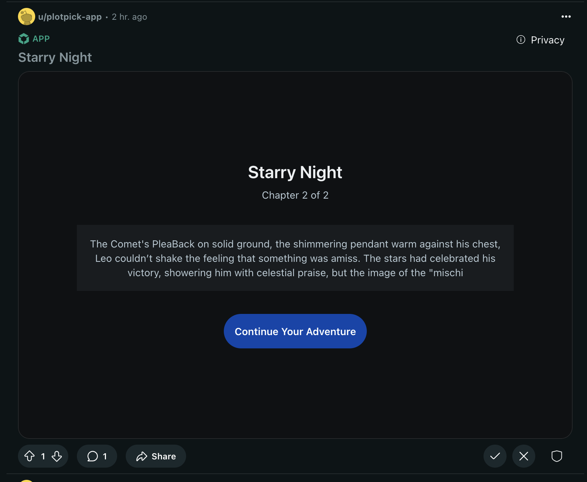
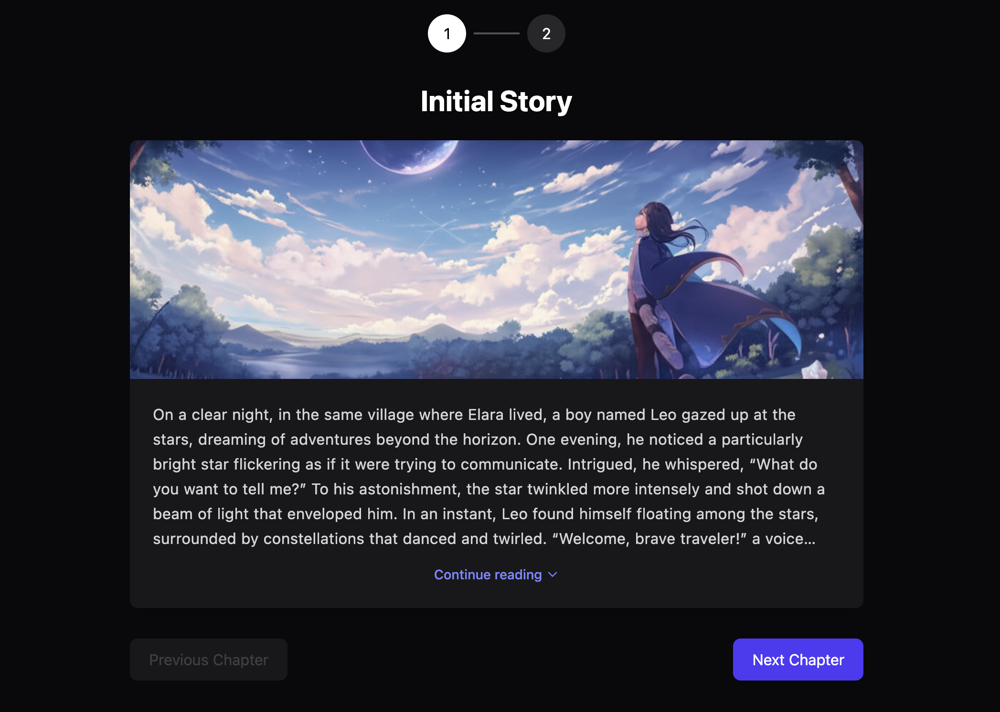

# PlotPick Game

Community driven [Devvit](https://developers.reddit.com) game where users can pick the plot of the game.

🌐 Live Demo: https://www.reddit.com/r/PlotPickGame/comments/1jk2prj/starry_night

📂 Source code: https://github.com/TejasBhovad/reddit-hacks

📱 Application: https://developers.reddit.com/apps/plotpick-app

Each post starts with an inital story and users can comment on the post with their ideas for the next part of the story. The most upvoted comment is used to generate the next part of the story using Gemini Flash Models, an image is also generated based on this.

## Features used

1. Scheduler: Each day the top comment is used to generate the next part of the story and the image.
2. Reddit API: To fetch the top comment of the post and delete the previous day's comments.
3. Preview Image: To generate the preview text of the post.
4. Gemini Flash Models: To generate the next part of the story and the image.

## LLMs used

- gemini-2.0-flash: for generating the next part of the story
- gemini-2.0-flash-exp-image-generation: for generating the image based on the story

NOTE: We are on the free plan of Gemini Flash Models so there can be significant downtime in case of exhausted credits.

> Yes there is typescript and javascript both in the files, cause I dislike typescript(mostly cause dont use it extensively) but devvit requires typescript as entry point.

This repository was based on [github.com/TejasBhovad/devvit-template](https://github.com/TejasBhovad/devvit-template)

Upvote the post on DevPost [here](https://devpost.com/software/plotpick)
